# Features included in PrestaMailReceiverBundle

## Commands

- `presta:mail-receiver:receive` : Receive email content and store it
- `presta:mail-receiver:dispatch` : Dispatch waiting emails to matching rules actions
- `presta:mail-receiver:archive` : Remove emails that have spent a certain amount of time in a given status
  - `waiting`: 1 month
  - `treated`: 3 days
  - `unmatched`: 4 months
  - `errored`: 2 weeks

## Integration into Sonata

The bundle comes with Sonata interfaces for configuring rules and groups of rules, and for viewing incoming e-mails and rule executions.

### Menu
The available items are :
- `presta_mail_receiver.admin.email`
- `presta_mail_receiver.admin.rule`
- `presta_mail_receiver.admin.execution`
- `presta_mail_receiver.admin.rule_group`


> Example:
> ```yaml
> # sonata_admin.yaml
> sonata_admin:
>     dashboard:
>         groups:
>             presta_mail_receiver:
>                 label: Emails received
>                 icon: '<i class="fa fa-envelope" aria-hidden="true"></i>'
>                 translation_domain: admin
>                 items:
>                     - presta_mail_receiver.admin.email
>                     - presta_mail_receiver.admin.rule
>                     - presta_mail_receiver.admin.execution
>                     - presta_mail_receiver.admin.rule_group
> ```
>
> 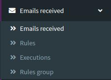

### Emails received
#### list
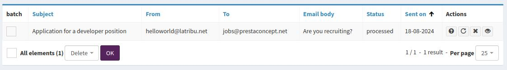
#### details
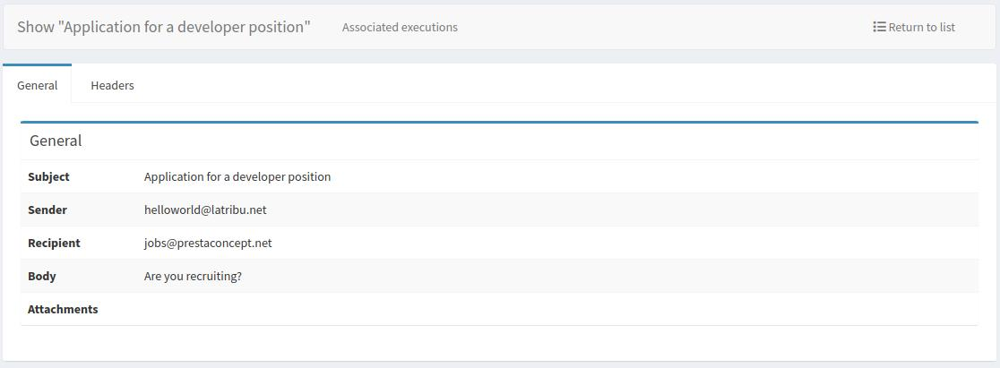
#### processed tests
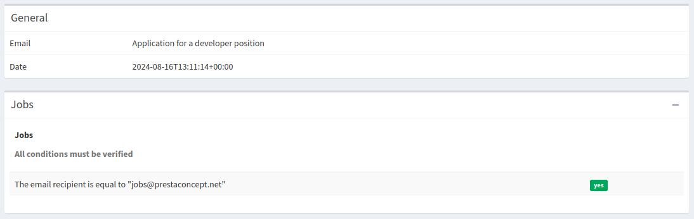

### Rules
#### list
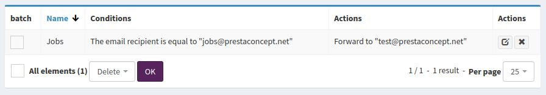
#### edition
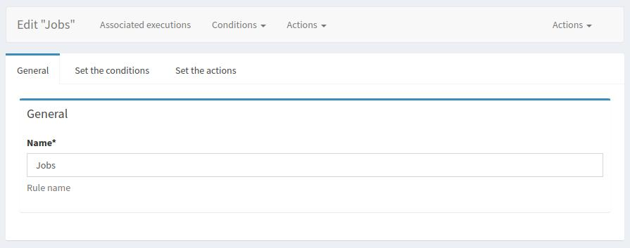
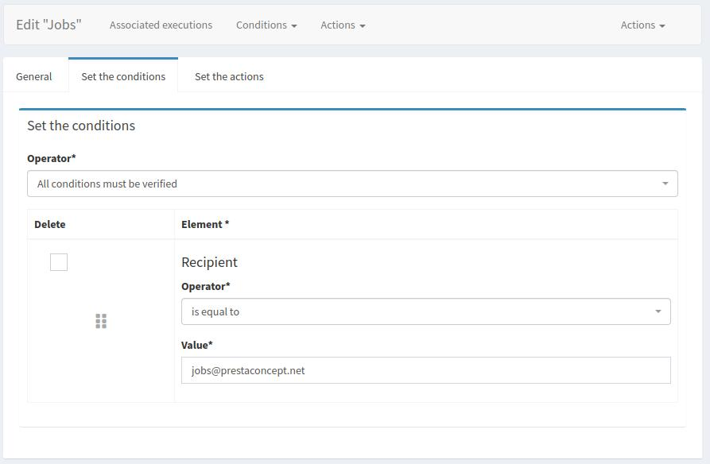
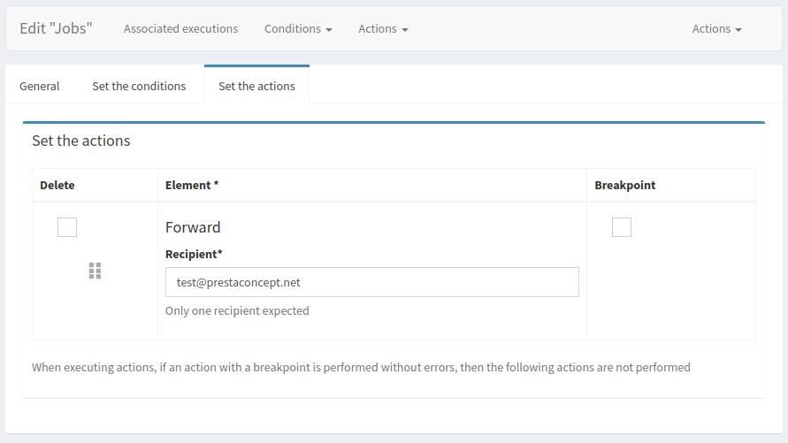
#### edition - add action/condition
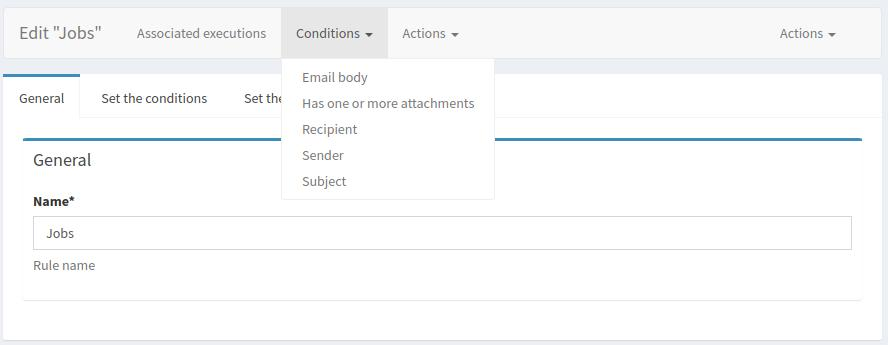
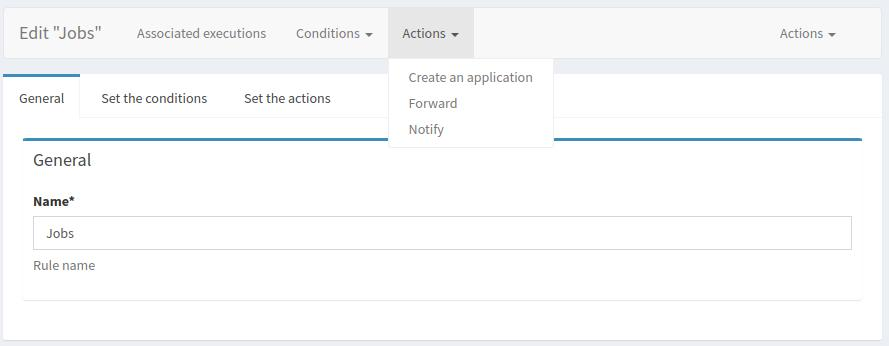

### Executions
#### list
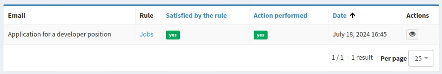
#### details
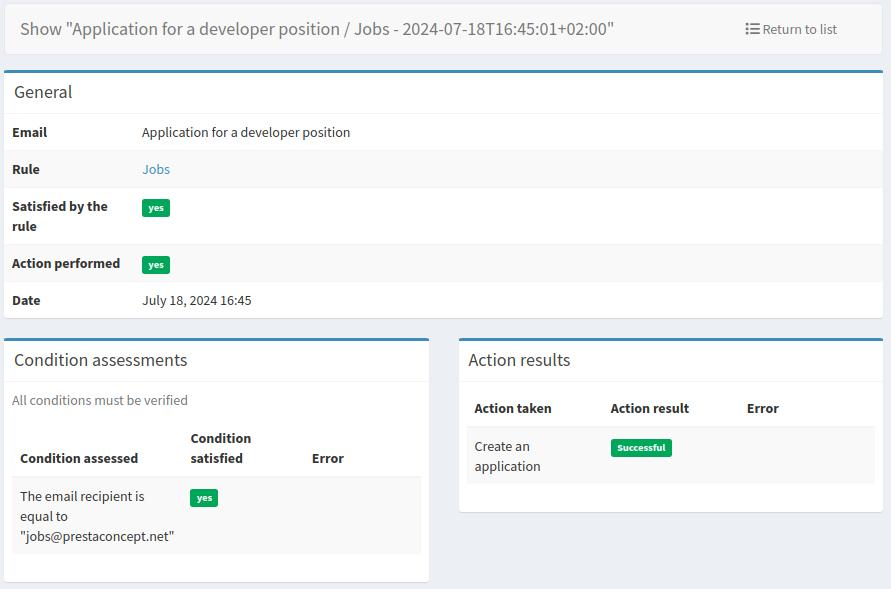

### Rules group
#### list
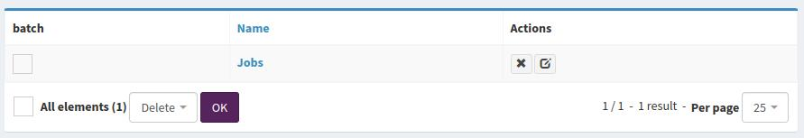
#### edition
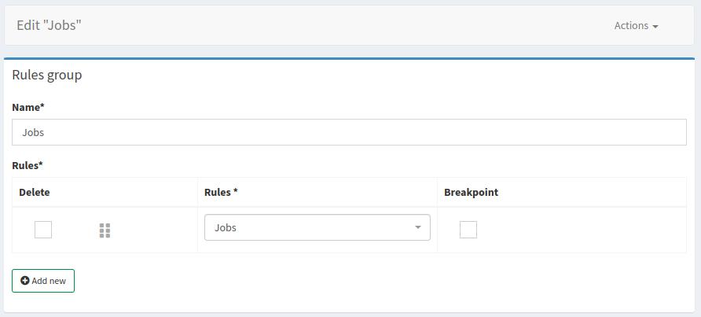
